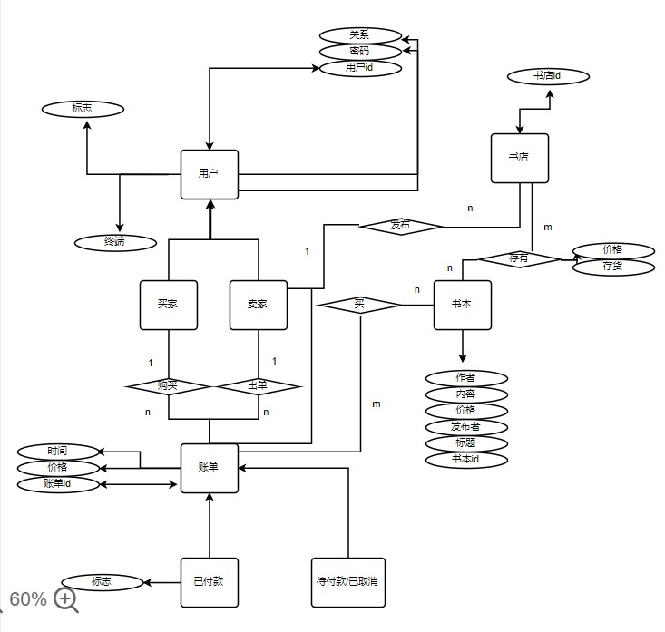
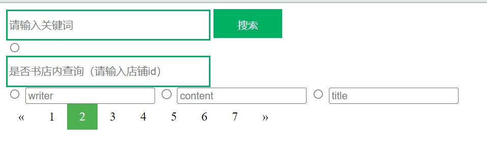
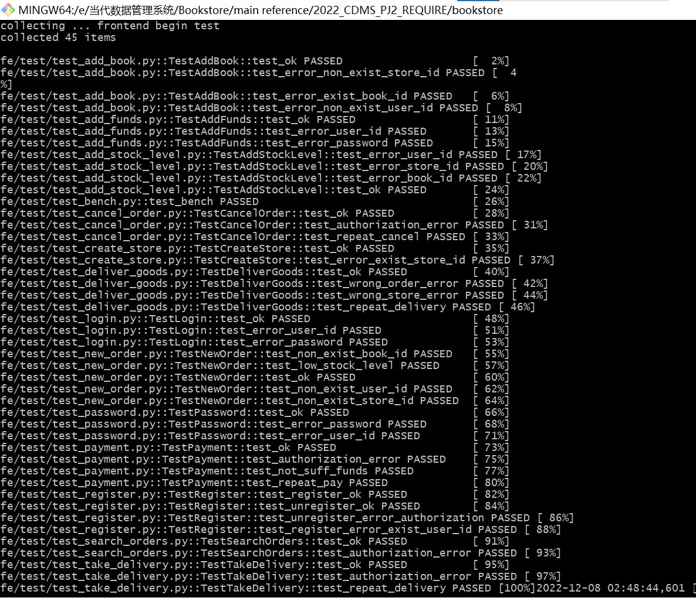
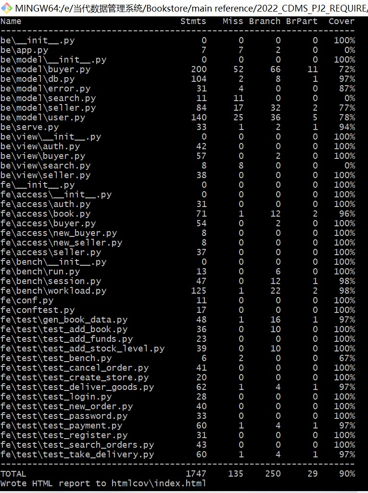
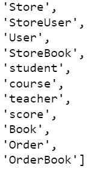
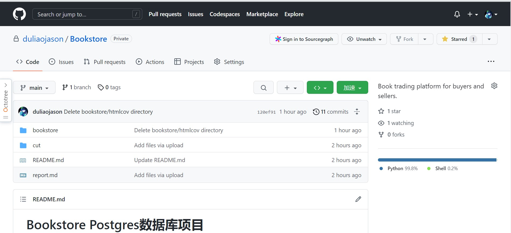

## Bookstore实验报告

| 课程名称 |  当代数据库管理系统   |
| :------: | :-------------------: |
| 小组成员 | 魏海斌  廖泽盛 郑智玮 |
| 实践日期 | 2022/12/1-2022/12/10  |


## 实验要求

### 功能：

#### 实现一个提供网上购书功能的网站后端。
#### 网站支持书商在上面开商店，购买者可以通过网站购买。

#### 买家和卖家都可以注册自己的账号。

#### 一个卖家可以开一个或多个网上商店， 买家可以为自已的账户充值，在任意商店购买图书。

#### 支持 下单->付款->发货->收货 流程。

#### 1.实现对应接口的功能，见项目的doc文件夹下面的.md文件描述 （60%）

#### 其中包括：

#### 1)用户权限接口，如注册、登录、登出、注销

#### 2)买家用户接口，如充值、下单、付款

#### 3)卖家用户接口，如创建店铺、填加书籍信息及描述、增加库存

#### 通过对应的功能测试，所有test case都pass

#### 2.为项目添加其它功能 ：（40%）

#### 1)实现后续的流程
#### 发货 -> 收货

#### 2)搜索图书
#### 用户可以通过关键字搜索，参数化的搜索方式； 如搜索范围包括，题目，标签，目录，内容；全站搜索或是当前店铺搜索。 如果显示结果较大，需要分页 (使用全文索引优化查找)

#### 3)订单状态，订单查询和取消定单
#### 用户可以查自已的历史订单，用户也可以取消订单。
#### 取消定单可由买家主动地取消定单，或者买家下单后，经过一段时间超时仍未付款，定单也会自动取消。

------


## 索引

### 1 关系数据库设计 

####     1.1 数据库整体设计思路 

#####              1.1.1 ⽤户 

#####              1.1.2 用户和书店关系 

#####              1.1.3 书店的设计 

#####              1.1.4 账单状态表

####      1.2ER图设计 

####      1.3 数据库构建原则

##### 1.3.1设计原则

##### 1.3.2设计思考

##### 1.3.3连接方式

##### 1.3.4事务处理

### 2功能设计与业务逻辑  

####      2.1 auth ⽤户功能

#####              2.1.1 注册⽤户 

#####              2.1.2 注销⽤户 

#####              2.1.3 ⽤户更改密码 

#####              2.1.4 ⽤户登出 

####      2.2 buyer 买家⽤户接⼝ 

#####              2.2.1 买家下单 

#####              2.2.2 买家付款 

#####              2.2.3 买家充值 

#####              2.2.4 买家取消订单 

#####              2.2.5 买家确认收货 

#####              2.2.6 买家通过关键词获取图书列表 

#####              2.2.7 买家评价已完成订单 

#####              2.2.8 买家查看店铺评价 

#####              2.2.9 买家查看订单状态 

#####              2.2.10 买家查看所有进⾏中的订单 

#####              2.2.11 买家查看所有交易完成订单 

#####              2.2.12 实现订单定期失效功能 

####      2.3 seller 卖家⽤户接⼝ 

#####               2.3.1 创建商铺 

#####               2.3.2 书店添加书籍信息 

#####               2.3.3 书店添加书籍库存 

#####               2.3.4 卖家确认发货 

#### 3 测试 

####      3.1 正确性测试 

####      3.2 代码覆盖率 

####      3.3 并发场景下吞吐量测试 

####      3.4 实验中的疑问和改进 

#####                3.4.1 表格创建

#####                3.4.2 Runtime Error

##### 3.4.3代码结构以及测试中遇到的问题

#### 3.5testcase实现

#### 3.6索引、事务处理(性能考量)

### 4 开发过程与分⼯ 

####      4.1 开发过程 

####      4.2 分⼯

### 5实验总结

------


## 1 关系数据库

### 1.1 关系数据库设计思路

#### 1.1.1 用户

##### 用户子类：买家和卖家

##### 用户包含属性：用户id（唯一属性），密码（单值属性），余额，判断重复登陆的标志

| user_id                          | password | flag    | terminal | balance |
| -------------------------------- | -------- | ------- | -------- | ------- |
| String                           | String   | Integer | String   | String  |
| id为主键，可以查询所有关键的信息 |          |         |          |         |

#### 1.1.2 用户和书店关系 

| store_id                                   | user(user_id) |
| ------------------------------------------ | ------------- |
| String                                     | 外键FK        |
| 将商店和用户之间联系起来，在user上添加索引 |               |

#### 1.1.3 书店的设计 

##### 书店包含属性：书本id（唯一属性），标题，作者，发布者，价格

| book_id                                    | title  | author | publisher | price  |
| ------------------------------------------ | ------ | ------ | --------- | ------ |
| Integer                                    | String | String | String    | String |
| id是主键，将发布者和书本之间的关系直接连接 |        |        |           |        |

#### 1.1.4 账单状态表

##### 账单状态表分为待付款和已结账两种形式

##### 账单表中包含的属性：订单id（唯一属性），买家id（外键），书店id（外键），价格，交易时间，标志（区分待付款和已结账）

##### 账单信息表：

| order_id                                       | book_id | count   | price   |
| ---------------------------------------------- | ------- | ------- | ------- |
| String                                         | 外键FK  | Integer | Integer |
| order_id是主键，订单的id和书本的id是直接连接的 |         |         |         |

##### 待付款账单表：

| order_id                                                     | buyer_id | store_id | price   | time     |
| ------------------------------------------------------------ | -------- | -------- | ------- | -------- |
| String                                                       | 外键FK   | 外键FK   | Integer | DataTime |
| 这里不仅包括待付款的订单，同样还包括被取消的订单，这里都不设置标志，标志位在已付款订单中添加 |          |          |         |          |

##### 已付款账单表：

| order_id                                                     | buyer_id | store_id | price   | status  | time     |
| ------------------------------------------------------------ | -------- | -------- | ------- | ------- | -------- |
| String                                                       | 外键FK   | 外键FK   | Integer | Integer | DataTime |
| 这里设置status（标志位），为了区分待付款（或取消的账单）和已结账 |          |          |         |         |          |

### 1.2 ER图设计 



### 1.3 数据库构建原则

#### 1.3.1设计原则

##### 设计数据库时，采用严格分离的方式（简单来说，就是存储的部分永远只负责存储，同理，读取数据的部分只负责读取），两者之间产生联系，通过上层接口的实现方法进行操作。

##### 实行这些操作的核心目的都是为了提高覆盖率，最大程度的实现高效性。

#### 1.3.2设计思考

##### 本实验使用的是Orm+Postgresql的框架，在实验的时候需要考虑协作性，所以决定采用阿里云端的数据库，并且在github上进行合作，最大程度的通过git提高合作的效率。

#### 1.3.3连接方式

##### Psycopy是针对python的Postgres 数据库的适配模块，安装psycopg2可以整合python和Postgres 。使用[cmd](https://so.csdn.net/so/search?q=cmd&spm=1001.2101.3001.7020)输入命令进行安装：

```assembly
 pip install psycopg2
```

##### 在pycharm中选择Database，点击左上角的+添加数据库，选择postgresql:
##### 创建数据库连接后点击apply，数据库会显示在右侧窗格中

##### 下面使用 psycopy2.connect()方法连接到postgresql数据库。通过调用cursor类中的execute()方法对数据库进行操作。在execute()中用SQL语句创建表。使用commit()将数据发送到数据库服务器，最后使用close()关闭数据库。commit()能够对数据库进行改变，且不可逆。

##### connect() 方法的参数一般包括:

`database: 要连接的数据库名称`
`user:连接数据库的用户名`
`password: 连接数据库的密码`
`host: 数据库端口的地址，一般为 “localhost”,或者主机的IP地址`
`port: 门户 默认为5432`

##### 接下来就可以创建表格了。

#### 1.3.4事务处理

##### 官方文档中对Postgresql有一段这样的描述：

`Starting from version 2.5, psycopg2’s connections and cursors are context managers and can be used with the with statement:
When a connection exits the with block, if no exception has been raised by the block, the transaction is committed. In case of exception the transaction is rolled back.
When a cursor exits the with block it is closed, releasing any resource eventually associated with it. The state of the transaction is not affected.
A connection can be used in more than a with statement and each with block is effectively wrapped in a separate transaction:`

##### 当我们用Postgresql进行事务处理时一定会遇到这种问题，此时就需要使用到with。上面这段的意思简单来说就是意思是：从2.5版本开始，pypg2可以使用with上下文进行事务管理。

##### 并且当with连接中的语句发生了异常，事务就会回滚，否则就会被提交；

##### 当游标退出with块时，它将关闭，从而释放最终与之关联的所有资源。交易状态不受影响；

##### 一个连接可以在多个分离的事务中使用，互不影响。


## 2功能设计与业务逻辑  

### 2.1 auth ⽤户功能

#### 2.1.1 注册⽤户 

##### 注册用户的时候，最重要的就是注意用户名是否重复；

##### 如果没有重复，那么就将用户id（唯一属性），密码（单值属性），余额，判断重复登陆的标志等属性一并添加到用户的表中去。

#### 2.1.2 注销⽤户 

##### 注销和注册非常相似，或者说是完全相反的操作，最重要的是检查需要被注销的用户是否存在于用户表中；

##### 如果存在，那么将用户id（唯一属性），密码（单值属性），余额，判断重复登陆的标志等属性一并从用户的表中删去。

#### 2.1.3 ⽤户更改密码 

##### 首先需要得到本来用户的密码（通过用户id得到）；

##### 新输入的密码要与旧的密码进行比较，不可以与旧的密码重复；

##### 一旦以上两点满足，将直接对用户的密码进行更新操作。

#### 2.1.4 ⽤户登出 

##### 首先需要检查需要登出的用户正处于登录的状态；

##### 确定之后，即可将标志改变，并且登出该用户。

### 2.2 buyer 买家⽤户接⼝ 

#### 2.2.1 买家下单 

##### 首先需要观察买家下单的订单信息，如果在书店中有足够的库存，并且书本不在交易状态中，那么就可以被购买；

##### 如果以上条件都满足，那么操作实现之后，需要减少库存，并且在账单列表中加入购买价格，购买者，购买数量，购买时间等重要的交易信息。

#### 2.2.2 买家付款

 ##### 在允许买家付款之前，一定要首先确定待付款账单是否存在（这是通过书店id可以得到的），并且通过此操作，还需要得到待支付的具体金额；

##### 支付一定需要密码，所以要通过得到用户密码的方式来完成账单。此过程需要比较的是是否用户的密码相同;

##### 只要密码是正确的，那么此账单便可以顺利完成（反之，则支付失败）；

##### 一定要注意，在本实验中给每一个用户设置了余额这个属性（一旦账单支付成功，买家的余额将被扣除，同时卖家的余额将增加）；

##### 最后，将已支付的订单从待支付中删除，并且添加到总的账单信息表中。此表记录卖家，买家，交易时间，金额等重要信息。

#### 2.2.3 买家充值 

##### 此功能实现的前提是用户输入的密码需要与数据库中的密码匹配；

##### 一旦匹配成功，便可以实时查看用户的余额情况。

#### 2.2.4 买家取消订单 

##### 取消账单一共分为两种情况，一种是主动取消，一种是被动取消。

##### 主动取消：这只存在与还没有发货并且账单处于未支付的状态下才成立的（通过用户id以及卖家与买家之间的账单交易情况可以确定账单情况），一旦确定账单处于可以被主动取消的情况，那么需要在用户表中更新买家和卖家的余额情况，并且将此被取消的账单信息加入到账单信息表中。

```python
#以下是买家主动取消订单的代码
    def cancel_order(self, order_id, user_id, password) -> tuple((int, str)):
            user = session.query().first()
            if user is None:
            if user.password != password:
            order = session.query().first()
            if order is None:
            if order.status != 0:
```

##### 自动取消：自动取消账单产生的原因就是账单长时间处于未支付的状态，那么到时间就会被自动取消。在本实验中，采取的方法是间隔一秒通过新的线程检查是否存在超时的账单，一旦发现超时，那么账单将被直接取消。同时建立一张表格，将时间接近取消的账单添加进表格中，方便后续的检查。（通过python中的threading实现，需要注意的是，需要自定义方法在操作终止时记录结束的时间）

```python
#以下就属于支付超时的情况，在这里设定时间不可以超过1天，否则到时间订单就会自动取消  
           for od in result:
                if (cur_time - od.time).days > 1:
                    od.status = -1
                    session.add(od)
                    continue
```

#### 2.2.5 买家确认收货 

##### 首先通过买家的id确定此账单的具体信息（是否发货，账单状态是否与买家对应并且正常）；

```python
#以下是大致实现框架    
    def take_delivery(self, order_id, user_id, password) -> tuple((int, str)):
            user = session.query().first()
            if user is None:
            if user.password != password:
            order = session.query(
            ).first()
            if order is None:
            if order.status != 2:
```


##### 一旦以上条件都符合，那么就将视买家已经收到货。

#### 2.2.6 买家通过关键词获取图书列表 

##### 搜索操作有非常多的实现方法（可以根据作者名，书本名，特定标签等等形式）；

##### 主要的实现逻辑就是以全文章或者书店为最大的目标，通过特定的select语句，得到想要得到的信息：

```assembly
 " SELECT title,author,content,publisher,signal"
            "FROM book WHERE book_id in "
```

##### 具体可以分为全局搜索和店铺内搜索：

##### 全局搜索：可以参考作者的名字，书本基本信息，或者通过书本标签还有题目等内容进行搜索。

```assembly
records = self.session.execute(
            " SELECT title,author,content,publisher,signal "
            "FROM book WHERE book_id in "
            "(select book_id from book_content where book_content='%s' and search_id BETWEEN %d and %d)" % (
            book_intro, 10*page-10,10*page-1)).fetchall()
```

##### 店铺内搜索：可以通过作家名字，书本基本信息，或者书本标签还有题目进行搜索。

```assembly
records = self.session.execute(
            " SELECT title,author,content,publisher,signal "
            "FROM book WHERE book_id in "
            "(select book_id from book_content where book_content='%s') and "
            "book_id in (select book_id from store where store_id='%s')"
            "LIMIT 10 OFFSET %d"% (book_intro, store_id,10*page-10)).fetchall()
```

##### 还可以通过各种哈希算法（差值，均值，感知，小波哈希等方法）实现图搜索。

##### 对于搜索实现了前端的可视化：



#### 2.2.7 买家评价已完成订单 

##### 需要通过用户的id对账单表中的信息进行调取，可以得到用户自己之前已经生效的账单的详细信息（包括账单状态，评价等重要信息）

#### 2.2.8 买家查看店铺评价 

##### 需要通过用户的id对账单表中的信息进行调取，可以得到用户自己之前已经生效的账单的详细信息，除此之外，还可以得到其他用户对于该书店的评价，和不透露隐私的账单信息（包括账单生效时间，买家id，卖家id等）

#### 2.2.9 买家查看订单状态 

##### 买家可以通过自己的id对账单信息进行查看（不仅可以查看待付款的账单，还可以直接连接到账单信息表中，查看已付款账单和被取消的账单），等同于查看历史订单

```python
    def search_orders(self, user_id, password) -> tuple((int, str, [])):
            cur_time = datetime.datetime.now()
            cur_time = datetime.date(cur_time.year, cur_time.month, cur_time.day)
            user = session.query().first()
            if user is None:
            if user.password != password:
```

#### 2.2.10 买家查看所有进⾏中的订单 

##### 买家可以通过自己的id对账单信息进行查看（通过账单信息表，可以查看到自己待支付的账单和即将失效的账单）

#### 2.2.11 买家查看所有交易完成订单 

##### 买家可以通过自己的id对账单信息进行查看（通过账单信息表，可以查看到自己已经支付的账单和被取消的账单）

### 2.3 seller 卖家⽤户接⼝ 

#### 2.3.1 创建书店

##### 这里需要遵循一个用户只能创建一个书店的原则（当然可以放入多本书），检查用户id和书店id是否重复；

##### 如果满足条件，那么就会创建一个新的书店，并且将用户id插入新生成的书店id当中去。

#### 2.3.2 书店添加书籍信息 

##### 在该用户的书店中添加书本信息之前，首先要确定用户id和该用户的书店id存在并且匹配；

##### 满足条件的话还需要判断书本id是否在书店中存在重复；

##### 一旦不存在重复，那么就将新的书本id添加到书店中，并且将价格和书本id等信息添加到可购买的行列中。

#### 2.3.3 书店添加书籍库存 

##### 在该用户的书店中添加书本信息之前，首先要确定用户id和该用户的书店id存在并且匹配；

##### 满足条件的话还需要判断书本id是否在书店中存在重复；

##### 如果存在重复的情况，那么就需要将书店id中对应的书本id增加库存，并且需要在书店的表格中更新。

#### 2.3.4 卖家确认发货 

##### 通过账单的id对账单的实时状态进行查询（并且需要对应书店id）；

##### 一旦发现账单的状态是未完成发货，那么需要比较书店id和卖家id；

```python
#以下为实现的大致框架
    def deliver_goods(self, order_id, store_id) -> tuple((int ,str)):
        try:
            if not self.store_id_exist(store_id):
            order = session.query(
            ).first()
            if order is None:
            if order.status != 1:
```

##### 如果满足以上条件，那么更新账单状态为已发货。


## 3 测试 

### 3.1 正确性测试 

##### 在进行测试之前，首先需要将database进行数据的更新：

```assembly
python ./update database/update_clear.py
python ./update database/update_book.py
python ./update database/update_database.py
python ./update database/update_search.py
```

##### 数据库更新完成之后进行测试：

```assembly
bash script/test.sh
```

##### 

####      3.2 代码覆盖率 

##### 在各项测试执行之前，首先需要对每一个test写对应的testcase，在对功能进行完善和调整，接下来进行代码覆盖率测试：



##### 通过上面测试的数据，可以看出代码的覆盖率是92%，我认为这是一个比较高的覆盖率了（其中核心部分buyer.py、seller.py和user.py的覆盖率也都较好）。

####      3.3 并发场景下吞吐量测试 

##### 吞吐量测试：

##### 分别对大表和小表进行测试，首先先下载更大的数据集（更多的数据 book_lx.db 可以从网盘下载，下载地址为：）

```
https://pan.baidu.com/s/1bjCOW8Z5N_ClcqU54Pdt8g
```

##### 提取码：

```
hj6q
```

##### 小表测试结果大约有每秒10笔的吞吐量，延迟大约在每笔百分之5；

##### 小表测试结果大约有每秒11笔的吞吐量，延迟大约也在每笔百分之5。

##### 经过实验可以发现这样的吞吐量是远远不够的，可以通过计算并发数的方式，计算出正确的吞吐量，以达到预期。

####      3.4 实验中的疑问和改进 

#####                3.4.1表格创建

#####                创建表格时没有办法确定每一个属性的具体数据类型以及需要分配的空间大小

##### 需要经过之后的test，一点点调整（通过将大量属性修改为Text，并且调整user当中的password还有terminal变量等），可以大大提高代码覆盖率。

#####                3.4.2Runtime Error

##### 在运行测试的时候，如果提示"RuntimeError: Not running with the Werkzeug Server"，请输入下述命令，将flask和Werkzeug的版本均降低为2.0.0。

```assembly
 pip install flask==2.0.0  

 pip install Werkzeug==2.0.0）
```

##### 3.4.3代码结构以及测试中遇到的问题

##### 作业的前60%看似只需要修改be/model中的内容，但是实验时一定要按照fe/test当中的文件进行修改。在修改的过程中如果一遍一遍地运行代码实在是太慢了，所以需要将

#### 3.5testcase实现（以下详细测试数据见代码）

##### （1）在搭建完数据库之后，首先对数据库进行检查（连接engine之后导入书本的表作为例子进行检测）gen_book_data.py的测试：

```python
#根据book的title和id查找书本是否被成功导入
session = DBSession()
result = session.query(Book.title).filter(Book.id == 1).all()
session.close()
print(result)
```

```python
#检查表格是否全都被创建成功
from sqlalchemy.engine.reflection import Inspector
ispt = sqlalchemy.inspect(engine)
ispt.get_table_names()
```



```python
#检查数据库中是不是被存入了书籍
with engine.connect() as conn:
    result = conn.execute("SELECT * FROM Book limit 2")
    result = result.fetchall()
    for i in result:
        print(result)
```


##### (2)test_add_book.py

```python
    #创建 测试书本添加
    test_store_book = StoreBook1(
        id = '',
        stock_level= ,
        book_info = '',
    )
```

##### (3)test_create_store.py/test_add_stock_level.py

```python
    # 创建 测试商店
    test_store_1 = Store1(
        store_id = '',
        book_id = ,
        stock_level = ,
        price = , # 价格单位是分
    )
```

##### (4)test_login.py/test_add_funds.py(结合用户买书或卖出书进行测试)

```python
    #创建 登录用户    
    test_user_2 = User1(
        user_id = '',
        password = '',
        balance = ,
        token = '',
        terminal = ''
    )
```

##### （5）test_new_order.py

```python
    #创建 测试新的订单
    test_order_unpaid = OrderBook1(
        order_id = '',
        buyer_id = '',
        store_id = '',
        price = ,
        purchase_time = datetime.now(),
    )
```

##### （6）test_password.py(在先注册用户之后，执行以下测试)

```python
    # 创建 测试用户
    test_user_3 = User1(
        user_id = '',
        password = '',
        balance = ,
        token = '',
        terminal = ''
    )
```

##### （7）test_payment.py(在存在订单的情况下，执行以下测试)

```python
    # 创建 测试订单
    test_order_paid = Order1(
        order_id = '',
        buyer_id = '',
        store_id = '',
        price = ,
        purchase_time = datetime.now(),
        status = 0  # 未发货
    )
```

##### （8）test_register.py(尝试注册不存在和已经存在用户的区别)

```python
    # 创建 测试用户
    test_user_1 = User1(
        user_id = '',
        password = '',
        balance = ,
        token = '',
        terminal = ''
    )
```

#### 3.6索引、事务处理(性能考量)

##### 大部分情况在制作表的时候都添加了主键，所以，只需要通过主键，对id进行查询，便可以实现更新；

##### 在订单状态，订单查询和取消定单这些功能实现的时候，基本的用户订单表（包含卖家商品信息，买家是否付款等重要信息）还是通过主键，实现对id查询，便可以一次实现更新，但是在书店中的store量却需要更新k次（k是购买书籍的数量），而且用户表（user表）也需要更新两次（买家和卖家分别更新一次）。


## 4 开发过程与分⼯

 ### 4.1 开发过程 

##### 设计了ER图，并且根据设计的ER图，创建表格（在创建表格时出现了非常多值得探讨的问题，比如如何确定变量大小，如何使用或添加索引，如何解决冗余问题）；

##### 本小组全程使用git进行开发和协作，分模块，高效的完善实验项目，并进行测试和调试；

##### 通过在云上部署数据库的方式进行协作。

##### github仓库链接：

https://github.com/duliaojason/Bookstore

##### 以下是部分在github上的项目版本控制截图：




##### 时间安排：（大致分为两个阶段）

##### 第一阶段：实现前60%（主要内容涉及三个重要的模块，分别是seller，buyer和store），每个人完成一个模块，均可以参考三个对应模块的md文件。至于函数的实现，为了防止出现重复，写之前需要具体商量。（时间跨度11.28-12.4）

##### 第二阶段：实现后40%（主要需要实现的内容就是争对orm进行优化，在实现形式上添加status），还有就是实现各类形式的搜索（实现一个简单的可以检索的前端）。（时间跨度12.4-12.9）

### 4.2 分⼯

##### 魏海斌：git协作，云上实现数据库，数据库搭建，seller功能实现，代码覆盖率测试，报告撰写

##### 廖泽盛：ER图设计，搜索功能实现，数据库搭建，buyer功能实现，代码覆盖率测试，报告撰写，git仓库搭建

##### 郑智玮：git协作，testcase（测试接口）编写，数据库搭建，author功能实现，代码覆盖率测试，报告撰写


## 5实验总结

##### 在项目实践开发的过程中，要更多地编写代码进行测试。只有更多地利用现有的测试代码，查找现存代码的漏洞，对代码进行迭代完善，才能使得项目使用起来更加高效。